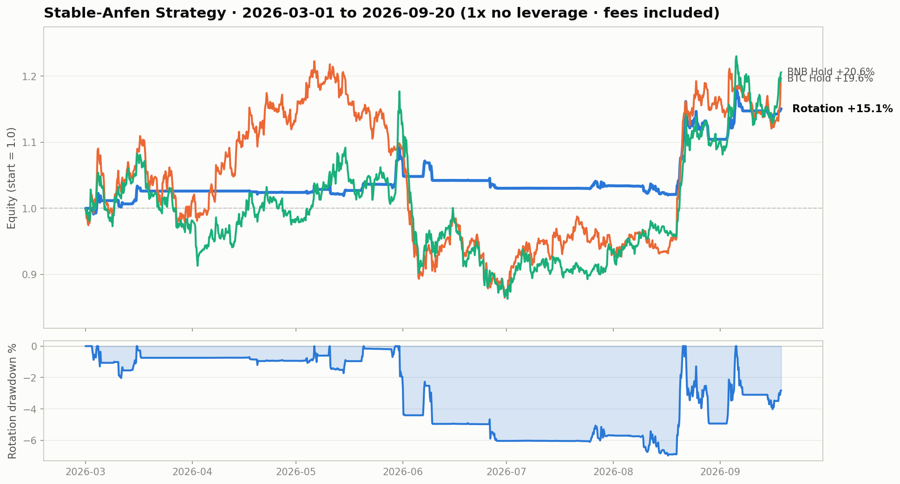

# Stable-Anfen Strategy

 

**A conservative crypto quant strategy** — BTC + BNB dual-gun 1x no-leverage momentum rotation. Designed around one goal: *low drawdown, sleep well at night*. ML safety-score gating + dual-gun equity blending + 70/30 momentum rotation, all at a constant 1x leverage.

---

## ⚠️ Disclaimer (read first)

- This project is **for education and research only** and does not constitute investment advice.
- **A good backtest never guarantees live profits.** Backtests exclude funding fees, slippage variance and liquidity impact; live performance is usually worse than backtest.
- Crypto is extremely volatile and past performance does not indicate future results. **Trade at your own risk.**
- The author assumes no liability for any loss caused by using this code (see [MIT License](./LICENSE)).

---

## Strategy at a Glance

| Dimension | Design |
|-----------|--------|
| Assets | BTC, BNB (USDT perpetual or spot, constant 1x) |
| Timeframe | 4-hour candles |
| Core | ML safety-score gate (6-horizon Logistic Regression rolling training) |
| Architecture | Dual-gun equity blending (main gun + scout gun, Sigmoid dynamic weights) |
| Portfolio | BTC/BNB 20-day momentum ranking → 70/30 rotation |
| Trading cost | 0.07% per side included in backtest |

**Core idea**: don't predict direction — answer "should I be in the market right now?" When the ML safety score is low, stay flat unconditionally; only when it passes the gate do DVOL-turn signals become tradeable. The two guns' equity curves are blended by trend state, and momentum rotation puts weight on the stronger coin.

---

## Backtest Results (2026-03-01 → 2026-09-19)



| Metric | Dual-Core Rotation 70/30 | BTC Solo | BNB Solo | BTC Hold | BNB Hold |
|--------|:---:|:---:|:---:|:---:|:---:|
| Total return | **+15.06%** | +2.24% | +26.52% | +19.64% | +20.59% |
| CAGR | +29.03% | +4.11% | +53.33% | +38.52% | +40.53% |
| Max drawdown | **-6.96%** | -3.95% | -9.64% | -29.25% | -26.67% |
| Sharpe | **1.79** | 0.72 | 2.13 | 1.13 | 1.14 |
| Trades | 69 | 20 | 49 | — | — |
| Win rate | 44.9% | 45.0% | 44.9% | — | — |

> In this 6-month window buy & hold earned more in absolute terms, but with ~30% drawdowns. The rotation delivered clearly better risk-adjusted returns (Sharpe 1.79 vs 1.13) with **4x smaller drawdown**. That is exactly this strategy's positioning: it optimizes the drawdown floor, not the return ceiling.

---

## Repository Layout

```
📁 stable-anfen-strategy/
├── 📄 stable_anfen_strategy.py   # core strategy (ML training, dual-gun, rotation)
├── 📄 backtest.py                # backtest entry point (equity chart + stats)
├── 📄 fetch_data.py              # data fetcher (Binance klines + Deribit DVOL)
├── 📁 data/                      # sample data (2021-01 → 2026-09, 4h)
│   ├── btcusdt_4h.csv
│   ├── bnbusdt_4h.csv
│   ├── deribit_dvol_btc_4h.csv
│   ├── btc_80D_wfa.csv           # 80-day walk-forward dynamic threshold
│   └── bnb_80D_wfa.csv
└── 📁 docs/
    └── backtest_2026_sample.png  # sample backtest chart
```

---

## Quick Start

```bash
# 1. Install dependencies (Python 3.10+)
pip install -r requirements.txt

# 2. (Optional) refresh data — skip if the bundled data/ snapshot is enough
python fetch_data.py

# 3. Run the backtest (default window 2026-03-01 → today; outputs chart + stats)
python backtest.py

# Custom window
python backtest.py --start 2025-01-01 --end 2025-12-31

# Compare against buy & hold
python backtest.py --start 2026-03-01 --vs-hold
```

---

## Strategy Details

### 1. Data & Features

- **Price**: Binance public klines, 4h, BTCUSDT / BNBUSDT
- **Volatility**: Deribit DVOL index (BTC implied volatility), 4h
- **Features**:
  - `z` = 60-bar rolling Z-score of DVOL (≈10 days)
  - `dz` = first difference of `z`
  - `trigger` = upward crossing of `dz` through zero (volatility bottoming out)
  - `vol` = ATR14 / close (vol filter; disabled in the Stable-Anfen edition)

### 2. ML Safety Score (core gate)

A Logistic Regression is trained per horizon out of 6 (1/3/5/7/14/30 days) to predict "will price rise over the next H bars", yielding probability `p_H`; **safety score = median of the 6 probabilities**.

Training uses an **Expanding Window**: retrained every 42 bars (7 days) since 2022-06, with sample weights governed by two rules:

- **Time decay**: exponential decay with an 18-month (540-day) half-life — recent samples weigh more
- **Critical event anchoring**: samples whose absolute forward return ranks in the top 5% percentile get weight reset to 1.0 (big moves must not be forgotten by time decay)

**Gating rule**: `safety score < dynamic threshold → flat / close unconditionally`. The dynamic threshold comes from an 80-day walk-forward analysis (WFA) optimization stored in `{coin}_80D_wfa.csv`, falling back to a static 0.52 when missing.

### 3. Main Gun (DVOL-turn gun)

- Entry: gate open + `trigger` turn + current return r > 0, and the short-horizon score (mean of p_6/p_18/p_30) ≥ T_short (BTC 0.54 / BNB 0.50)
- Exit: gate closes, or `trigger` with r < 0
- Queue mechanism: when the trigger fires but the short-horizon score is insufficient, the signal enters a 12-bar (48h) waiting queue; entry happens if the score recovers within the window

### 4. Scout Gun (trend breakout gun)

- Entry: 20-bar momentum > 0 and close breaks the 20-bar high (HH20)
- Exit: close breaks the 10-bar low
- Also constant 1x — no leverage components at all

### 5. Dual-Gun Blending

Scout weight `w = 0.40 / (1 + e^(-0.3 · Z_MA200))`, where Z_MA200 is the close's percentage deviation from the 200-day moving average: **in strong trends the scout gun's weight rises automatically (max 40%); in chop the main gun dominates**. The two guns' equity curves are merged by these weights.

### 6. Momentum Rotation (70/30)

After BTC and BNB each complete their dual-gun runs, weights are assigned by **120-bar (20-day) momentum ranking**: rank 1 gets 70%, rank 2 gets 30%. Rotation is performed at the equity level, adding no rebalancing friction.

---

## Data Sources & Updates

| Data | Source | Notes |
|------|--------|-------|
| 4h klines | Binance public API (`/api/v3/klines`) | free, no key needed |
| DVOL | Deribit public API (`get_volatility_index_data`) | free, no key needed |

**⚠️ Update caveat**: Deribit keeps fine-grained (hourly) DVOL history for only ~42 days; earlier history is only available at 12h granularity. `fetch_data.py` handles this automatically — recent periods use fine data, older periods use 12h data forward-filled to 4h (matching the original live pipeline). As a result **DVOL for older periods is a step-wise approximation** and triggers there are slightly duller than reality.

---

## Known Limitations (honest backtest statement)

1. **DVOL approximation**: older history uses 12h granularity forward-filled, not true 4h values (see above).
2. **Funding fees excluded**: perpetual funding (~-0.01%/8h magnitude) is not modeled.
3. **No slippage model**: only 0.07%/side fees; larger capital will slip more in live trading.
4. **No look-ahead bias**: all signals are generated at bar t close and filled at t+1 open; ML training only uses data before t.
5. **Single market**: validated on BTC/BNB only; other assets untested.

---

## License

[MIT License](./LICENSE) — free to use, modify and commercialize; keep the copyright notice.
